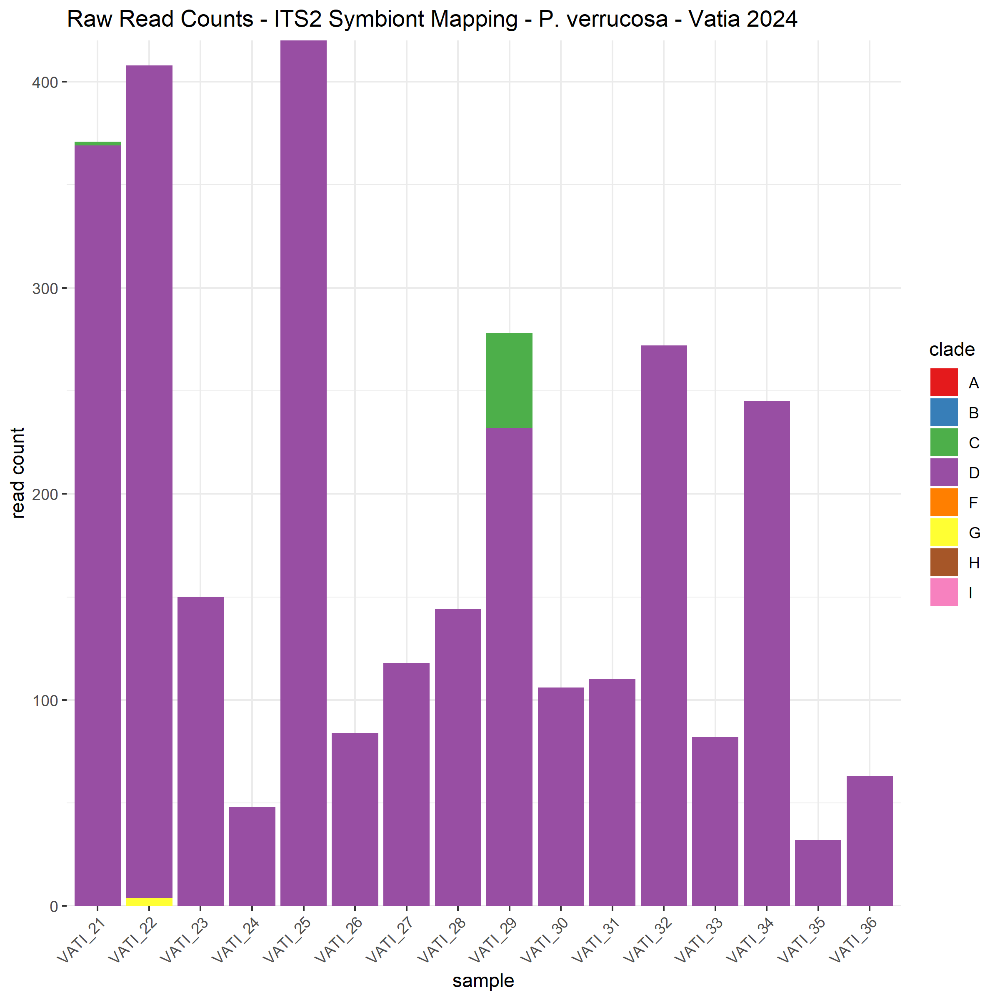
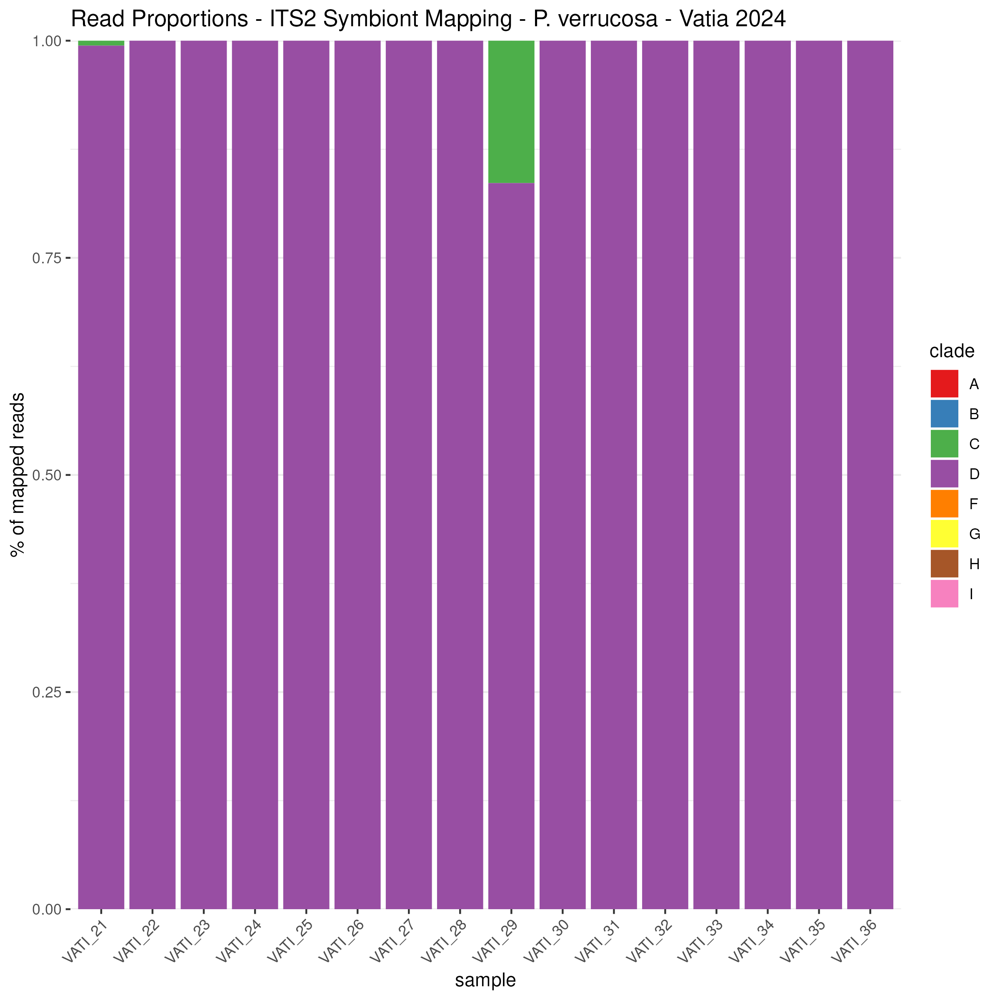

# ITS2 Symbiont Profiling by Mapping Pipeline (Sym-Mapping)

**Author:** Jason A. Toy  
**Date:** 2024-09-05   

## DISCLAIMER:
### This pipeline is still in development. Use at your own risk. If you find issues, or have suggestions, pull requests are welcome.

## Set up sample table and sample list

### Table format

This pipeline is set up to link fastq prefix names with sample details
based on a **fastq table** in
`$BASEDIR/sample_lists/fastq_table_pver_pilot.txt`, set up as described
below. Create these files for your samples before starting your
analysis. This approach is borrowed from the pipelines of the
Therkildsen Lab Group at Cornell University
([GitHub](https://github.com/nt246/lcwgs-guide-tutorial)).

For the scripts below to work, the sample table has to be a tab
deliminated table with the following six columns, strictly in this
order:

-   `prefix` the prefix of raw fastq file names

-   `lane_number` lane number; each sequencing lane or batch should be
    assigned a unique identifier. This is important so that if you
    sequence a library across multiple different sequencing lanes, you
    can keep track of which lane/batch a particular set of reads came
    from (important for accounting for sequencing error patterns or
    batch effects).

-   `seq_id` sequence ID; this variable is only relevant when different
    libraries were prepared out of the same sample and were run in the
    same lane (e.g. if you wanted to include a replicate). In this case,
    seq\_id should be used to distinguish these separate libraries. If
    you only have a single library prepared from each of your samples
    (even if you sequence that same library across multiple lanes), you
    can just put 1 for all samples in this column.

-   `sample_id` sample ID; a unique identifier for each individual
    sequenced

-   `population` population name; the population or other relevant
    grouping variable that the individual belongs to

-   `data_type` data type; there are only two allowed entries here: pe
    (for paired-end data) or se (for single end data). We need this in
    the table because for some of our processing steps, the commands are
    slightly different for paired-end and single-end data.

It is important to make sure that the combination of sample\_id,
seq\_id, and lane\_number is unique for each fastq file.

You can also add additional columns to the end of the table as you see
fit, but the first 6 must be in the order listed above.  

We’ll also use a second file that we call a **fastq list**. This is
simply a list of prefixes for the samples we want to analyze. If the
samples to be analyzed include all the samples in the **fastq table**,
the **fastq list** can be created by running the following command:

    cut -f1 fastq_table_pver_pilot.txt | tail -n +2 > fastq_list_pver_pilot.txt

 

### Check environment variables

Then check that the environment is working as expected by using a for
loop to print the sample IDs for all sample files in your sample list:

    BASEDIR=/cm/shared/courses/dbarshis/barshislab/jtoy/pver_gwas_pilot/
    # Change this to your base working directory

    SAMPLELIST=$BASEDIR/sample_lists/fastq_list_pver_pilot.txt
    # Path to a list of prefixes of the raw fastq files. It should be a subset of the the 1st column of the fastq table.

    SAMPLETABLE=$BASEDIR/sample_lists/fastq_table_pver_pilot.txt
    # Path to a fastq table where the 1st column is the prefix of the raw fastq files. The 4th column is the sample ID.

    #Use a for loop to print the sample IDs for all sample files in your sample list:

    for SAMPLEFILE in `cat $SAMPLELIST`; do
        # For each prefix, extract the associated sample ID (column 4) and population (column 5) from the table
        SAMPLE_ID=`grep -P "${SAMPLEFILE}\t" $SAMPLETABLE | cut -f 4`
        POPULATION=`grep -P "${SAMPLEFILE}\t" $SAMPLETABLE | cut -f 5`
        echo $SAMPLEFILE refers to sample $SAMPLE_ID from $POPULATION

    done

 

## Check read quality and trim reads using fastp (v0.23.2)

Make a new directory in the $BASEDIR/reports directory called
`fastp_reports`

    mkdir $BASEDIR/reports/fastp_reports

 

Create array SLURM script to run fastp on all samples at once
(`fastp_array.slurm`):

    nano fastp_array.slurm

###
    #!/bin/bash

    #SBATCH --job-name fastp_array_2024-07-22
    #SBATCH --output=%A_%a_%x.out
    #SBATCH --error=%A_%a_%x.err
    #SBATCH --mail-type=ALL
    #SBATCH --mail-user=jtoy@odu.edu
    #SBATCH --partition=main
    #SBATCH --array=1-16%16
    #SBATCH --ntasks=1
    #SBATCH --mem=30G
    #SBATCH --time 5-00:00:00

    ## Load modules
    module load container_env
    module load fastp

    ## Define environmental variables
    BASEDIR=/cm/shared/courses/dbarshis/barshislab/jtoy/
    RAWDATA=$BASEDIR/raw_sequence_data/2024-07-11_TxGenPverrucosaTestSet/24200Brs_N24114 #path to raw fq.gz files
    OUTDIR=$BASEDIR/pver_gwas_pilot/trimmed_fastq
    SAMPLELIST=$BASEDIR/pver_gwas_pilot/sample_lists/fastq_list_pver_pilot.txt # Path to a list of prefixes of the raw fastq files
    SAMPLETABLE=$BASEDIR/pver_gwas_pilot/sample_lists/fastq_table_pver_pilot.txt # Path to a sample table
    RAW_R1=_R1_001.fastq.gz # Suffix of raw fastq files of forward reads
    RAW_R2=_R2_001.fastq.gz # Suffix of raw fastq files of reverse reads

    ## Keep a record of the Job ID
    echo $SLURM_JOB_ID

    ## Select the SAMPLE from the SAMPLELIST
    SAMPLEFILE=`head $SAMPLELIST -n $SLURM_ARRAY_TASK_ID | tail -n 1`

    ## Keep record of sample file
    echo $SAMPLEFILE

    ## Extract table values of sample, populaiton ID, sequence ID, and lane ID (columns 4, 5, 3, 2, respectively) for each sequenced library. This will be used for the naming of trimmed/processed files
    SAMPLE_ID=`grep -P "${SAMPLEFILE}\t" $SAMPLETABLE | cut -f 4`
    POP_ID=`grep -P "${SAMPLEFILE}\t" $SAMPLETABLE | cut -f 5`
    SEQ_ID=`grep -P "${SAMPLEFILE}\t" $SAMPLETABLE | cut -f 3`
    LANE_ID=`grep -P "${SAMPLEFILE}\t" $SAMPLETABLE | cut -f 2`
    SAMPLE_UNIQ_ID=$SAMPLE_ID'_'$SEQ_ID'_'$LANE_ID  # When a sample has been sequenced in multiple lanes, we need to be able to identify the files from each run uniquely

    echo $SAMPLE_UNIQ_ID

    ## Define the output path and file prefix
    SAMPLETRIM=$OUTDIR/$SAMPLE_UNIQ_ID

    ## Run fastp
    crun.fastp fastp -i $RAWDATA/$SAMPLEFILE$RAW_R1 \
        -I $RAWDATA/$SAMPLEFILE$RAW_R2 \
        -o ${SAMPLETRIM}_f_paired_trim.fastq.gz \
        -O ${SAMPLETRIM}_r_paired_trim.fastq.gz \
        --adapter_fasta $BASEDIR/pver_gwas_pilot/adapters.fa \
        --cut_tail \
        --trim_poly_g \
        -l 40 \
        -h $BASEDIR/pver_gwas_pilot/reports/fastp_reports/${SAMPLE_UNIQ_ID}_fastp.html \
        -j $BASEDIR/pver_gwas_pilot/reports/fastp_reports/${SAMPLE_UNIQ_ID}_fastp.json \
        --thread 20

Run script:

    sbatch fastp_array.slurm

 

Move html reports to new subdirectory:

    mkdir $BASEDIR/reports/fastp_reports/html_reports

    mv *.html html_reports

 

### Visualize with MultiQC (v1.13)

Run multiqc on the directory with the json report files:

    module load container_env
    module load multiqc/1.13

    crun.multiqc multiqc --interactive --filename multiqc_report_pver_pilot_fastp_interactive .
    # --interactive forces the creation of an interactive html file even when sample sizes are high (instead of a flat file)

 

### Run FastQC on trimmed (fastp) reads:

First create a new sample list for trimmed files:

    # make new directory
    mkdir $BASEDIR/reports/fastqc_trimmed_reports

    # make new sample list of trimmed files
    cd $BASEDIR/trimmed_fastq

    ls *.fastq.gz > $BASEDIR/sample_lists/fastq_trimmed_list_pver_pilot.txt

    # if for some reason you just want a list of single prefixes for each samples (instead of two file names (f and r) per sample), you can make this with the following commands:
    for FILE in `ls *.fastq.gz`; do
      echo ${FILE%_r_*} >> $BASEDIR/sample_lists/temp.txt
    done

    grep -v "paired_trim.fastq.gz" $BASEDIR/sample_lists/temp.txt  > $BASEDIR/sample_lists/fastq_trimmed_list_pver_pilot_single_prefixes.txt

    rm $BASEDIR/sample_lists/temp.txt

 

Then run array script `fastqc_array.slurm`:

    #!/bin/bash

    #SBATCH --job-name fastqc_array_2024-07-23
    #SBATCH --output=%A_%a_%x.out
    #SBATCH --error=%A_%a_%x.err
    #SBATCH --mail-type=ALL
    #SBATCH --mail-user=jtoy@odu.edu
    #SBATCH --partition=main
    #SBATCH --array=1-32%32
    #SBATCH --ntasks=1
    #SBATCH --mem=30G
    #SBATCH --time 5-00:00:00

    ## Load modules
    module load container_env
    module load fastqc/0.11.9

    ## Define some variables
    BASEDIR=/cm/shared/courses/dbarshis/barshislab/jtoy/pver_gwas_pilot/
    SEQDATA=$BASEDIR/trimmed_fastq/ #path to fq.gz files
    OUTDIR=$BASEDIR/reports/fastqc_trimmed_reports/
    SAMPLELIST=$BASEDIR/sample_lists/fastq_trimmed_list_pver_pilot.txt #Path to a list of trimmed fastq files

    ## Keep a record of the Job ID
    echo $SLURM_JOB_ID

    ## Select the SAMPLE from the SAMPLELIST
    SAMPLEFILE=`head $SAMPLELIST -n $SLURM_ARRAY_TASK_ID | tail -n 1`

    ## Keep record of sample file
    echo $SAMPLEFILE

    ## Run FastQC
    crun.fastqc fastqc -t 16 -o $OUTDIR $SEQDATA/$SAMPLEFILE

Run script:

    sbatch $BASEDIR/scripts/fastqc_array.slurm

 

Compile reports with MultiQC:

    cd $BASEDIR/reports/fastqc_trimmed_reports/

    module load container_env
    module load multiqc/1.13

    crun.multiqc multiqc --interactive --filename multiqc_report_pver_pilot_fastqc_trimmed_interactive .
    # --interactive forces the creation of an interactive html file even when sample sizes are high (instead of a flat file)

### A note on duplicate estimates

The level of duplication estimated by fastp can be quite different from
FastQC. This seems to be a known/expected result because FastQC does not
analyze read data in pairs, while fastp does. FastQC estimates of
duplication are generally much higher than fastp estimates.  

 

## ITS2 symbiont typing

Before we can map the reads for downstream holobiont analyes, we need to
know what symbiont clades are present so that we can create a combined
holobiont genome.

We will use a version of the SymPortal database that we edited to trim
the end of the “I” clade sequences that were causing erroneous matches.
This file was uploaded to my `references` directory and is called
`Voolstra_SymPortal_published_div_20230315_Itrimmed.fasta`. You can download a copy from this repository.

Now we need to index the database so we can map to it:

    salloc --partition=main --exclusive
    tmux

    module load container_env
    module load bowtie2/2.4.1

    cd /cm/shared/courses/dbarshis/barshislab/jtoy/references

    crun.bowtie2 bowtie2-build Voolstra_SymPortal_published_div_20230315_Itrimmed.fasta Voolstra_SymPortal_published_div_20230315_Itrimmed
    #second argument is base name for index files that will be created

 
Then map the trimmed fastq files to the reference using the following
array job script, `its2_mapping_array.slurm`:
  
 
    
**!!! IMPORTANT NOTE - STOP AND READ !!!**

There is a fork in the pipeline at this point with two options:

**Option 1)** If you have not previously worked with your current species or population, I recommend continuing with the version that immediately follows, which is geared more towards data exploration and works well for a small test dataset. This version of the script will generate **two output SAM files**. The first is generated by the `bowtie2` command, which includes a `-k 5` argument that results in up to 5 “valid alignments” being reported per read pair. The other is a filtered version of the alignment file that includes only the best alignment for each query sequence. When working with a corals from a species or region that you have not worked with before, **it is a good idea to plot the symbiont proportions with both output files**.
Comparing the results of the two will give you an idea of the level confidence you should have that the reads were mapped to the correct symbiont genus. Ideally, the results will be qualitatively similar and you will move forward with the single-alignment SAM file.

**Option 2)** If you have worked with your species/region previously and/or are limited on storage space, skip down to the [Streamlined Mapping Pipeline](#streamlined-mapping-pipeline) section. This version runs the bowtie2 command without the -k option. This will use the default behavior which searches for distinct, valid alignments for each read. When it finds a valid alignment, it continues looking for alignments that are nearly as good or better. The best alignment found is reported (randomly selected from among best if tied). This will result in significantly smaller SAM files. This version of the pipeline also combines the mapping and deduplication steps into a single script and automatically removes intermediate BAM files as it progresses, which saves significant time and storage space.

`its2_mapping_array.slurm` (Option 1 - data exploration version):
    
    #!/bin/bash

    #SBATCH --job-name its2_mapping_array_2024-07-24
    #SBATCH --output=%A_%a_%x.out
    #SBATCH --error=%A_%a_%x.err
    #SBATCH --mail-type=ALL
    #SBATCH --mail-user=jtoy@odu.edu
    #SBATCH --partition=main
    #SBATCH --array=1-16%16
    #SBATCH --ntasks=1
    #SBATCH --mem=100G
    #SBATCH --time 5-00:00:00

    ## Load modules
    module load container_env
    module load bowtie2/2.4.1

    ## Define some variables
    BASEDIR=/cm/shared/courses/dbarshis/barshislab/jtoy
    FASTQDIR=$BASEDIR/pver_gwas_pilot/trimmed_fastq #path to trimmed fastq.gz files
    OUTDIR=$BASEDIR/pver_gwas_pilot/its2_mapping
    SAMPLELIST=$BASEDIR/pver_gwas_pilot/sample_lists/fastq_list_pver_pilot.txt # Path to a list of prefixes of the raw fastq files. It can be a subset of the the 1st column of the sample table.
    SAMPLETABLE=$BASEDIR/pver_gwas_pilot/sample_lists/fastq_table_pver_pilot.txt # Path to a sample table where the 1st column is the prefix of the raw fastq files. The 4th column is the sample ID, the 2nd column is the lane number, and the 3rd column is sequence ID. The combination of these three columns have to be unique. The 6th column should be data type, which is either pe or se.
    FASTQ_SUFFIX_1=_f_paired_trim.fastq.gz # Suffix to trimmed fastq files. Use forward reads with paired-end data.
    FASTQ_SUFFIX_2=_r_paired_trim.fastq.gz # Suffix to trimmed fastq files. Use reverse reads with paired-end data.
    REFBASENAME=Voolstra_SymPortal_published_div_20230315_Itrimmed

    ## Keep a record of the Job ID
    echo $SLURM_JOB_ID

    ## Select the SAMPLE from the SAMPLELIST
    SAMPLEFILE=`head $SAMPLELIST -n $SLURM_ARRAY_TASK_ID | tail -n 1`

    ## Keep record of sample file
    echo $SAMPLEFILE

    ## Extract relevant values from a table of sample, sequencing, and lane ID (here in columns 4, 3, 2, respectively) for each sequenced library. This is for the naming of trimmed/processed files
    SAMPLE_ID=`grep -P "${SAMPLEFILE}\t" $SAMPLETABLE | cut -f 4`
    POP_ID=`grep -P "${SAMPLEFILE}\t" $SAMPLETABLE | cut -f 5`
    SEQ_ID=`grep -P "${SAMPLEFILE}\t" $SAMPLETABLE | cut -f 3`
    LANE_ID=`grep -P "${SAMPLEFILE}\t" $SAMPLETABLE | cut -f 2`
    SAMPLE_UNIQ_ID=$SAMPLE_ID'_'$SEQ_ID'_'$LANE_ID  # When a sample has been sequenced in multiple lanes, we need to be able to identify the files from each run uniquely
    PU=`grep -P "${SAMPLEFILE}\t" $SAMPLETABLE | cut -f 2` # Define platform unit (PU), which is the lane number

    echo $SAMPLE_UNIQ_ID

    ## Define the output path and file prefix
    SAMPLEOUT=$OUTDIR/$SAMPLE_UNIQ_ID

    ## Run bowtie2
    crun.bowtie2 bowtie2 -p 30 --rg-id $SAMPLE_UNIQ_ID --rg SM:$SAMPLE_ID --rg LB:$SAMPLE_ID --rg PU:$PU --rg PL:ILLUMINA \
            --local -x $BASEDIR/references/$REFBASENAME -1 $FASTQDIR/$SAMPLE_UNIQ_ID$FASTQ_SUFFIX_1 -2 $FASTQDIR/$SAMPLE_UNIQ_ID$FASTQ_SUFFIX_2 \
            -k 5 -S $SAMPLEOUT'_bt2_'$REFBASENAME'.sam'

    ## Keep only best alignment (remove secondary alignments)
    module unload bowtie2
    module load container_env samtools
    crun.samtools samtools view -@30 -h $SAMPLEOUT'_bt2_'$REFBASENAME'.sam' | awk '($1 ~ /^@/ || !($2 ~ /^(12|13|29|45|77|141|93|157|109|173)$/))' > $SAMPLEOUT'_bt2_'$REFBASENAME'_k1.bam'

    # When the -k argument is used in bowtie2, the supplemental alignments (i.e. not the best alignment) are given a MAPQ score of 255. bowtie2 also reports unaligned reads by default. To remove these unnecessary lines from the alignment file, the above samtools/awk command is used. The list of sam flags in the awk command includes all flags that contain BOTH the bit set 0x4 (read is unmapped) and 0x8 (mate is unmapped), so it does not remove unaligned mates of aligned reads.

Run script:

    sbatch its2_mapping_array.slurm

\*Note that the summary Bowtie2 prints to stdout actually reports counts
of mapping read PAIRS in the first several lines, rather than single
reads (this is not clear at all until you try to reconcile their
numbers).  

 

Again, this script will generate **two output SAM files**. The first is
generated by the `bowtie2` command, which includes a `-k 5` argument that
results in up to 5 “valid alignments” being reported per read pair. The
other is a filtered version of the alignment file that includes only the
best alignment for each query sequence. When working with a corals from
a species or region that you have not worked with before, **it is a good
idea to plot the symbiont proportions with both output files**.
Comparing the results of the two will give you an idea of the level
confidence you should have that the reads were mapped to the correct
symbiont genus. Ideally, the results will be qualitatively similar and
you will move forward with the single-alignment data set.  

`bowtie2` also reports unaligned reads by default with the `YT:Z:UP` code. The samtools command in the above script removes these only if both reads in a pair are unmapped. This way if one of the reads of a pair aligned and the other did not, propper mate-pair information will be retained.

### Run array script `dedup_bams_array.slurm` to query-sort, deduplicate, and then coordinate-sort the merged bams:

MarkDuplicates can more accurately detect and remove duplicates when the input bam is query-sorted.

`dedup_bams_array.slurm`:

    #!/bin/bash
    
    #SBATCH --job-name dedup_merged_bams_array_2024-09-26
    #SBATCH --output=%A_%a_%x.out
    #SBATCH --error=%A_%a_%x.err
    #SBATCH --mail-type=ALL
    #SBATCH --mail-user=jtoy@odu.edu
    #SBATCH --partition=main
    #SBATCH --array=1-24%24
    #SBATCH --ntasks=1
    #SBATCH --mem=100G
    #SBATCH --time 5-00:00:00
    #SBATCH --cpus-per-task=16
    
    
    ## Load modules
    module load container_env
    module load container_env gatk
    GATK='crun.gatk gatk'
    
    ## Define some variables
    BASEDIR=/cm/shared/courses/dbarshis/barshislab/jtoy
    BAMDIR=$BASEDIR/pver_gwas_pilot/its2_mapping
    OUTDIR=$BASEDIR/pver_gwas_pilot/its2_mapping/dedup_bams
    SAMPLELIST=$BAMDIR/k1_bams_list.txt
    
    ## Keep a record of the Job ID
    echo $SLURM_JOB_ID
    
    ## Select the SAMPLE from the SAMPLELIST
    SAMPLEFILE=`head $SAMPLELIST -n $SLURM_ARRAY_TASK_ID | tail -n 1`
    
    ## Keep record of sample file
    echo $SAMPLEFILE
    
    ## Make directory
    mkdir -p $OUTDIR
    
    
    ## Query-sort for duplicate removal with GATK
    # Run SortSam to sort by query name and convert to BAM
    $GATK --java-options "-Xmx100G" SortSam \
      --INPUT $BAMDIR/$SAMPLEFILE \
      --OUTPUT $BAMDIR/${SAMPLEFILE%.*}'_qsorted.bam' \
      --SORT_ORDER queryname
    
    # Run validation of BAM file
    $GATK --java-options "-Xmx100G" ValidateSamFile \
      -I $BAMDIR/${SAMPLEFILE%.*}'_qsorted.bam' \
      -O $BAMDIR/${SAMPLEFILE%.*}'_qsorted.val' \
      -M VERBOSE
    
    ## Mark and remove duplicates
    $GATK --java-options "-Xmx100G" MarkDuplicates \
      -I $BAMDIR/${SAMPLEFILE%.*}'_qsorted.bam' \
      -O $OUTDIR/${SAMPLEFILE%.*}'_qsorted_dedup.bam' \
      --METRICS_FILE $OUTDIR/${SAMPLEFILE%.*}'_qsorted_dupstat.txt' \
      --REMOVE_DUPLICATES true
    
    ## Run validation of BAM file
    $GATK --java-options "-Xmx100G" ValidateSamFile \
      -I $OUTDIR/${SAMPLEFILE%.*}'_qsorted_dedup.bam' \
      -O $OUTDIR/${SAMPLEFILE%.*}'_qsorted_dedup.val' \
      -M VERBOSE
      
    ## Remove qsorted BAM files to make space
    rm $BAMDIR/${SAMPLEFILE%.*}'_qsorted.bam'
    
    ## Run SortSam to sort by coordinate for downstream processing
    $GATK --java-options "-Xmx100G" SortSam \
      --INPUT $OUTDIR/${SAMPLEFILE%.*}'_qsorted_dedup.bam' \
      --OUTPUT $OUTDIR/${SAMPLEFILE%.*}'_qsorted_dedup_coordsorted.sam' \
      --SORT_ORDER coordinate
    
    ## Run validation of coordinate-sorted BAM file
    $GATK --java-options "-Xmx100G" ValidateSamFile \
      -I $OUTDIR/${SAMPLEFILE%.*}'_qsorted_dedup_coordsorted.sam' \
      -O $OUTDIR/${SAMPLEFILE%.*}'_qsorted_dedup_coordsorted.val' \
      -M VERBOSE
      
    ## Remove qsorted deduped BAM files to make space
    rm $OUTDIR/${SAMPLEFILE%.*}'_qsorted_dedup.bam'

Run script:

    sbatch dedup_bams_array.slurm

To count reads and compile read counts, we will need to create a list of
contigs (strain names) from the reference database:

    cd /cm/shared/courses/dbarshis/barshislab/jtoy/references

    grep ">" Voolstra_SymPortal_published_div_20230315_Itrimmed.fasta | cut -c 2- > its2_strain_names.txt

    # Add header "sym" to list file
    nano its2_strain_names.txt

    cat its2_strain_names.txt

    sym
    C42.2
    C1
    C42i
    C1b
    C115k
    C3mk
    C42m
    C42bw
    C1j

 

Count reads mapping to each contig (strain) using
`countmappedreads_JT.py`. This will create a counts file for
every .sam file:

    module load container_env
    module load python2

    crun.python2 python2 $BASEDIR/pver_gwas_pilot/scripts/countmappedreads_JT.py -t 15 -l 40 -a 40 $BASEDIR/pver_gwas_pilot/its2_mapping/*k1_qsorted_dedup_coordsorted.sam

Edit the filtering flags as you see fit:
`-t` = MAPQ threshold (make sure you understand how bowtie2 calculates MAPQ - hint: it's not intuitive)
`-l` = alignment length threshold
`-a` = alignment score (AS) threshold

 

Compile counts files into one data file using
`ParseExpression2BigTable_advbioinf.py`.

    cd $BASEDIR/its2_mapping

    crun.python2 python2 ../scripts/ParseExpression2BigTable_advbioinf.py ../../references/its2_strain_names.txt pver_pilot_its2_counts_merged.txt no_match *coordsorted_counts.txt

        # Script usage:
          #sys.argv[1] Input file name            #list of your "gene" names (list must have a header line!)
          #sys.argv[2] Output file name
          #sys.argv[3] Text to add when no match
          #sys.argv[4:] Any number of files to add columns from

 

The output file shows the number of reads mapping to each strain with
one column for each sample:

    A1      0       0       0       0       0       0       0       0       0       0       0       0       0       0       0       0
    A1.2    0       0       0       0       0       0       0       0       0       0       0       0       0       0       0       0
    A10     0       0       0       0       0       0       0       0       0       0       0       0       0       0       0       0
    A10a    0       0       0       0       0       0       0       0       0       0       0       0       0       0       0       0
    A10b    0       0       0       0       0       0       0       0       0       0       0       0       0       0       0       0
    A11     0       0       0       0       0       0       0       0       0       0       0       0       0       0       0       0
    A12     0       0       0       0       0       0       0       0       0       0       0       0       0       0       0       0
    A13     0       0       0       0       0       0       0       0       0       0       0       0       0       0       0       0
    A13a    0       0       0       0       0       0       0       0       0       0       0       0       0       0       0       0

 

You can run these two steps using the script below. It is set up to be run from the directory containing the SAM files. Note that because the alignments may be multiply mapped, we want to first make sure the “columntoextract” variable in the `ParseExpression2BigTable_advbioinf.py` script is set to “4” (totalreadsgoodmapped) and not “2” (UniqueTotReads). Otherwise, it will only summarize the counts from the 2nd column and will therefore not include all mapped reads.

    module load container_env
    module load python2

    cd $BASEDIR/its2_mapping

    crun.python2 python2 ../scripts/countmappedreads_JT.py -t 15 -l 40 -a 40 $BASEDIR/pver_gwas_pilot/its2_mapping/*k1_qsorted_dedup_coordsorted.sam

    crun.python2 python2 ../scripts/ParseExpression2BigTable_advbioinf.py ../../references/its2_strain_names.txt pver_pilot_its2_counts_merged.txt no_match *coordsorted_counts.txt

        # Script usage:
          #sys.argv[1] Input file name #list of your "gene" names (list must have a header line!)
          #sys.argv[2] Output file name
          #sys.argv[3] Text to add when no match
          #sys.argv[4:] Any number of files to add columns from

 

Convert .sam files to .bam files to save space:

    module load samtools

    for FILE in *.sam; do
        crun.samtools samtools view -b -@ 38 -O BAM -o ${FILE%.*}.bam $FILE
    done

**From here, continue at the [Plot Symbiont Counts and Proportions](#plot-symbiont-counts-and-proportions) section.

 
## Streamlined Mapping Pipeline
This version of the `its2_mapping_array.slurm` script combines both the mapping and deduplicating steps and streamlines/cleans up the process in other ways.

`its2_mapping_array.slurm` (Option 2 - streamlined version):

    #!/bin/bash

    #SBATCH --job-name its2_mapping_array_pver_streamlined
    #SBATCH --output=%A_%a_%x.out
    #SBATCH --error=%A_%a_%x.err
    #SBATCH --mail-type=ALL
    #SBATCH --mail-user=jtoy@odu.edu
    #SBATCH --partition=main
    #SBATCH --array=1-24%24
    #SBATCH --ntasks=1
    #SBATCH --mem=100G
    #SBATCH --time 5-00:00:00
    
    
    ## Load modules
    module load container_env
    module load bowtie2/2.4.1
    
    ## Define some variables
    BASEDIR=/cm/shared/courses/dbarshis/barshislab/jtoy
    FASTQDIR=$BASEDIR/pver_gwas_pilot/trimmed_fastq #path to trimmed fastq.gz files
    OUTDIR=$BASEDIR/pver_gwas_pilot/its2_mapping
    SAMPLELIST=$BASEDIR/pver_gwas_pilot/sample_lists/fastq_list_pver_pilot.txt # Path to a list of prefixes of the raw fastq files. It can be a subset of the the 1st column of the sample table.
    SAMPLETABLE=$BASEDIR/pver_gwas_pilot/sample_lists/fastq_table_pver_pilot.txt # Path to a sample table where the 1st column is the prefix of the raw fastq files. The 4th column is the sample ID, the 2nd column is the lane number, and the 3rd column is sequence ID. The combination of these three columns have to be unique. The 6th column should be data type, which is either pe or se.
    FASTQ_SUFFIX_1=_f_paired_trim.fastq.gz # Suffix to trimmed fastq files. Use forward reads with paired-end data.
    FASTQ_SUFFIX_2=_r_paired_trim.fastq.gz # Suffix to trimmed fastq files. Use reverse reads with paired-end data.
    REFBASENAME=Voolstra_SymPortal_published_div_20230315_Itrimmed
                                                                                                                                                                                                                                                                ## Keep a record of the Job ID
    echo $SLURM_JOB_ID
    echo $SLURM_ARRAY_TASK_ID
    
    ## Select the SAMPLE from the SAMPLELIST
    SAMPLEFILE=`head $SAMPLELIST -n $SLURM_ARRAY_TASK_ID | tail -n 1`
    
    ## Keep record of sample file
    echo $SAMPLEFILE
    
    ## Extract relevant values from a table of sample, sequencing, and lane ID (here in columns 4, 3, 2, respectively) for each sequenced library. This is for the naming of trimmed/processed files
    SAMPLE_ID=`grep -P "${SAMPLEFILE}\t" $SAMPLETABLE | cut -f 4`
    POP_ID=`grep -P "${SAMPLEFILE}\t" $SAMPLETABLE | cut -f 5`
    SEQ_ID=`grep -P "${SAMPLEFILE}\t" $SAMPLETABLE | cut -f 3`
    LANE_ID=`grep -P "${SAMPLEFILE}\t" $SAMPLETABLE | cut -f 2`
    SAMPLE_UNIQ_ID=$SAMPLE_ID'_'$SEQ_ID'_'$LANE_ID  # When a sample has been sequenced in multiple lanes, we need to be able to identify the files from each run uniquely
    PU=`grep -P "${SAMPLEFILE}\t" $SAMPLETABLE | cut -f 2` # Define platform unit (PU), which is the lane number
                                                                                                                                                                                                                                                                echo $SAMPLE_UNIQ_ID
    
    ## Define the output path and file prefix
    SAMPLEOUT=$OUTDIR/$SAMPLE_UNIQ_ID
    
    
    ## Run bowtie2
    crun.bowtie2 bowtie2 -p 36 --rg-id $SAMPLE_UNIQ_ID --rg SM:$SAMPLE_ID --rg LB:$SAMPLE_ID --rg PU:$PU --rg PL:ILLUMINA \
            --local -x $BASEDIR/references/$REFBASENAME -1 $FASTQDIR/$SAMPLE_UNIQ_ID$FASTQ_SUFFIX_1 -2 $FASTQDIR/$SAMPLE_UNIQ_ID$FASTQ_SUFFIX_2 \
            -S $SAMPLEOUT'_bt2_'$REFBASENAME'.sam'
    
    # Note that the -k argument is not used here, but rather the default behavior which searches for distinct, valid alignments for each read. When it finds a valid alignment, it continues looking for alignments that are nearly as good or better. The best alignment found is reported (randomly selected from among best if tied). bowtie2 also reports unaligned reads by default with the YT:Z:UP code, and we need to keep these to maintain proper mate-pair information. Otherwise the SAM/BAM files will not pass validation.
    
    
    ## Add version number to bowtie2 command header line in SAM file (This may not be necessary for your version of bowtie, but it was for mine). If your BAM validations below throw errors because of a missing version number in the BAM header, uncomment the line below:
    # sed -i 's/PN:bowtie2\tVN:/PN:bowtie2\tVN:2.4.1/' $SAMPLEOUT'_bt2_'$REFBASENAME'.sam'
        
    
    ## Change modules
    module unload bowtie2
    module load container_env gatk
    GATK='crun.gatk gatk'
    
    ## Query-sort for duplicate removal with GATK
    # Run SortSam to sort by query name and convert to BAM
    $GATK --java-options "-Xmx100G" SortSam \
      --INPUT $SAMPLEOUT'_bt2_'$REFBASENAME'.sam' \
      --OUTPUT $SAMPLEOUT'_bt2_'$REFBASENAME'_qsorted.bam' \
      --SORT_ORDER queryname
    
    # Run validation of BAM file
    $GATK --java-options "-Xmx100G" ValidateSamFile \
      -I $SAMPLEOUT'_bt2_'$REFBASENAME'_qsorted.bam' \
      -O $SAMPLEOUT'_bt2_'$REFBASENAME'_qsorted.val' \
      -M VERBOSE
    
    #remove SAM file
    rm $SAMPLEOUT'_bt2_'$REFBASENAME'.sam'
    
    ## Mark and remove duplicates
    $GATK --java-options "-Xmx100G" MarkDuplicates \
      -I $SAMPLEOUT'_bt2_'$REFBASENAME'_qsorted.bam' \
      -O $SAMPLEOUT'_bt2_'$REFBASENAME'_qsorted_dedup.bam' \
      --METRICS_FILE $SAMPLEOUT'_bt2_'$REFBASENAME'_qsorted_dupstat.txt' \
      --REMOVE_DUPLICATES true
    
    ## Run validation of BAM file
    $GATK --java-options "-Xmx100G" ValidateSamFile \
      -I $SAMPLEOUT'_bt2_'$REFBASENAME'_qsorted_dedup.bam' \
      -O $SAMPLEOUT'_bt2_'$REFBASENAME'_qsorted_dedup.val' \
      -M VERBOSE
    
    ## Run SortSam to sort by coordinate to minimize BAM file storage size
    $GATK --java-options "-Xmx100G" SortSam \
      --INPUT $SAMPLEOUT'_bt2_'$REFBASENAME'_qsorted_dedup.bam' \
      --OUTPUT $SAMPLEOUT'_bt2_'$REFBASENAME'_qsorted_dedup_coordsorted.bam' \
      --SORT_ORDER coordinate
    
    ## Run validation of coordinate-sorted BAM file
    $GATK --java-options "-Xmx100G" ValidateSamFile \
      -I $SAMPLEOUT'_bt2_'$REFBASENAME'_qsorted_dedup_coordsorted.bam' \
      -O $SAMPLEOUT'_bt2_'$REFBASENAME'_qsorted_dedup_coordsorted.val' \
      -M VERBOSE
    
    #remove qsorted BAM file
    rm $SAMPLEOUT'_bt2_'$REFBASENAME'_qsorted_dedup.bam'

### Remove unaligned read pairs
Make list of dedup_coordsorted bams:

    ls *reheadered_qsorted_dedup_coordsorted.bam > $BASEDIR/ahya_gwas_txgen/sample_lists/dedup_coordsorted_bams_list.txt
 

Run `remove_unaligned_read_pairs_array.slurm` script. The counting step that follows this requires the input to be in SAM format. To make these files as small as possible, we must first remove all entries from the alignment files where neither read pair mapped successfully, leaving only the handful of successful ITS2 alignments. The output is a small SAM file with the suffix `no_unaligned.sam`.

    #!/bin/bash
    #SBATCH --job-name remove_unaligned_read_pairs_array
    #SBATCH --output=%A_%a_%x.out
    #SBATCH --error=%A_%a_%x.err
    #SBATCH --mail-type=ALL
    #SBATCH --mail-user=jtoy@odu.edu
    #SBATCH --partition=main
    #SBATCH --array=1-24%24
    #SBATCH --ntasks=1
    #SBATCH --mem=100G
    #SBATCH --time 5-00:00:00
    #SBATCH --cpus-per-task=16
    
    
    ## Load modules
    module load container_env samtools
    
    BASEDIR=/cm/shared/courses/dbarshis/barshislab/jtoy
    BAMLIST=$BASEDIR/pver_gwas_pilot/sample_lists/dedup_coordsorted_bams_list.txt
    BAMDIR=$BASEDIR/pver_gwas_pilot/its2_mapping
    SAMTOOLS='crun.samtools samtools'
    
    
    ## Loop over each sample
    # for SAMPLEBAM in `cat $BAMLIST`; do
    
    SAMPLEBAM=$(sed -n "${SLURM_ARRAY_TASK_ID},1p" $BAMLIST)
    echo Slurm array task ID is: $SLURM_ARRAY_TASK_ID
    echo Sample bam is $SAMPLEBAM

    ## Remove read pairs where neither read was aligned (leaves both reads in file when one aligned and the other did not)
    $SAMTOOLS view -h -@ 16 $BAMDIR/$SAMPLEBAM | awk '($1 ~ /^@/ || !($2 ~ /^(12|13|29|45|77|141|93|157|109|173)$/))' > $BAMDIR/${SAMPLEBAM%.*}_no_unaligned.sam
    
    echo 'done-zo woot!'

## Count mapped reads and compile count files into one data file
First we will need to create a list of contigs (strain names) from the reference database (if not already done previously):

    cd $BASEDIR/references/

    grep ">" published_div_20230315.fasta | cut -c 2- > its2_strain_names.txt

    # Add header "sym" to list file
    nano its2_strain_names.txt

    cat its2_strain_names.txt

 
    sym
    C42.2
    C1
    C42i
    C1b
    C115k
    C3mk
 

Now count reads mapping to each contig (strain) using countmappedreads_JT.py. This will create a counts file for every .sam file. Then compile counts files into one data file using ParseExpression2BigTable_advbioinf.py.  

You can run these two steps using the script below. It is set up to be run from the directory containing the SAM files. Note that because the alignments may be multiply mapped, we want to first make sure the “columntoextract” variable in the ParseExpression2BigTable_advbioinf.py script is set to “4” (totalreadsgoodmapped) and not “2” (UniqueTotReads). Otherwise, it will only summarize the counts from the 2nd column and will therefore not include all mapped reads.

    module load container_env
    module load python2

    BASEDIR=/cm/shared/courses/dbarshis/barshislab/jtoy
    
    cd $BASEDIR/ahya_gwas_txgen/its2_mapping/merged_bams/dedup_bams/
    
    ## Count reads
    crun.python2 python2 $BASEDIR/ahya_gwas_txgen/scripts/countmappedreads_JT.py -t 15 -l 40 -a 40 *dedup_coordsorted_no_unaligned.sam
    
    ## Compile counts files
    crun.python2 python2 $BASEDIR/pver_gwas_pilot/scripts/ParseExpression2BigTable_advbioinf.py $BASEDIR/references/its2_strain_names.txt pver_pilot_its2_counts_merged.txt no_match *dedup_coordsorted_no_unaligned_counts.txt

            # Script usage:
              #sys.argv[1] Input file name #list of your strain names (list must have a header line!)
              #sys.argv[2] Output file name
              #sys.argv[3] Text to add when no match
              #sys.argv[4:] Any number of files to add columns from

## Plot Symbiont Counts and Proportions
We can now plot the symbiont proportions for each sample. Start an
interactive RStudio Server session or download results file to your
local computer to run in Rstudio. Run the following R script:

    library(tidyverse)
    library(reshape2)
    library(RColorBrewer)

    setwd("C:/Users/jason/OneDrive/Documents/odu/projects/global_search_genomics/pver_gwas/")

    # load count data from ParseExpression2BigTable_advbioinf.py
    raw <- read_tsv("pver_pilot_its2_counts_merged.txt", col_names = TRUE)

    # make column names shorter
    col_names <- c("sym", "VATI_21", "VATI_22", "VATI_23", "VATI_24", "VATI_25", "VATI_26", "VATI_27", "VATI_28", "VATI_29", "VATI_30", "VATI_31", "VATI_32", "VATI_33", "VATI_34", "VATI_35", "VATI_36")

    colnames(raw) <- col_names

    # reshape data to long format for summarizing and plotting
    counts <- melt(raw) %>% mutate(clade = substr(sym,1,1)) %>% rename(sample = variable, count = value)

    # summarize counts by sample and clade
    sum_table <- counts %>% group_by(sample, clade) %>% summarise(clade_count = sum(count))

    # plot total counts
    ggplot(sum_table, aes(fill=clade, y=clade_count, x=sample)) + 
      geom_bar(position="stack", stat="identity") +
      scale_fill_brewer(palette="Set1") +
      ylab("read count") +
      ggtitle("Raw Read Counts - ITS2 Symbiont Mapping - P. verrucosa - Vatia 2024") +
      scale_y_continuous(expand = c(0,0)) +
      theme_bw() +
      theme(axis.text.x = element_text(angle = 45, hjust=1), panel.border = element_blank())

    ggsave(plot = last_plot(), file = "2024_pver_pilot_symbiont_total_counts_plot.png", width = 8, height = 8, units = "in")

    # calculate percent reads for each clade for each sample
    total_reads <- counts %>% group_by(sample) %>% summarise(total_count = sum(count))

    # merge data frames to add percent column to summary table
    sum_table_perc <- left_join(sum_table, total_reads, by = "sample") %>% mutate(perc = clade_count/total_count)

    # plot read counts as percentages
    ggplot(sum_table_perc, aes(fill=clade, y=perc, x=sample)) + 
      geom_bar(position="stack", stat="identity") +
      scale_fill_brewer(palette="Set1") +
      ylab("% of mapped reads") +
      ggtitle("Read Proportions - ITS2 Symbiont Mapping - P. verrucosa - Vatia 2024") +
      scale_y_continuous(expand = c(0,0)) +
      theme_bw() +
      theme(axis.text.x = element_text(angle = 45, hjust=1), panel.border = element_blank())

    ggsave(plot = last_plot(), file = "2024_pver_pilot_symbiont_proportions_plot.png", width = 8, height = 8, units = "in")

 

 

### Results Summary

-   Low overall mapping rates indicate that most of our sequence data is
    from the host (which is normally a good thing)
-   Mostly Durisdinium reads with some Cladocopium  

Sum of columns of the `pver_pilot_its2_counts_merged_filtered.txt`
output file (mapped read totals for each sample):

    Sum of column 2: 177
    Sum of column 3: 184
    Sum of column 4: 72
    Sum of column 5: 17
    Sum of column 6: 191
    Sum of column 7: 40
    Sum of column 8: 53
    Sum of column 9: 70
    Sum of column 10: 122
    Sum of column 11: 46
    Sum of column 12: 51
    Sum of column 13: 130
    Sum of column 14: 42
    Sum of column 15: 114
    Sum of column 16: 15
    Sum of column 17: 31
